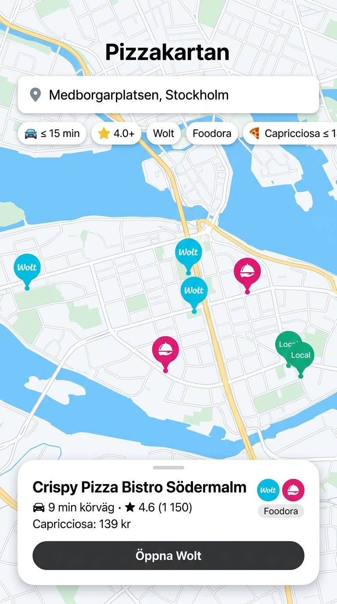

# 🍕 Pizzakartan – Södermalm

> **Hitta rätt pizza inom önskad körtid!**  
> Ett interaktivt pilotprojekt som kartlägger pizzerior på Södermalm i Stockholm och låter dig filtrera efter körtid, Google-betyg, leverantörskoppling (Wolt, Foodora, egen utkörning) och pris på specifika pizzor (t.ex. Capricciosa).

<p align="center">
  
</p>

---

## ✨ Funktioner

- 📍 **Dynamisk startposition & Körtidsberäkning:**
  - Sök på valfri gatuadress eller dra den blå nålen fritt på kartan.
  - Beräknar verkliga körtider via OSRM (Open Source Routing Machine) med automatisk fallback till en realistisk innerstadsmodell för Stockholm.
- ⭐ **Google-betyg & Recensioner:**
  - Dragreglage för att filtrera på lägsta betyg (t.ex. endast 4.2+ ★) samt sortering efter flest recensioner.
- 🛵 **Leverantörsfilter (Wolt / Foodora / Egen utkörning / Avhämtning):**
  - Färgkodade markörer på kartan (Cyan = Wolt, Rosa = Foodora, Grön = Egen utkörning, Grå = Endast avhämtning).
  - Direktknappar till restaurangsidorna med automatisk sök-fallback för att förhindra brutna länkar (404).
- 🍕 **Pizzaprisjämförelse:**
  - Välj pizzatyp (t.ex. *Capricciosa*, *Margherita*, *Vesuvio*, *Quattro Stagioni*, *Kebabpizza*) och ställ in pristak.
- 🖱️ **Interaktiv Mouseover:**
  - För muspekaren över ett pizzeriakort i listan så poppar kartans inforuta upp direkt med mjuk panorering.
- 📱 **Mobilanpassad "Map-First" Upplevelse:**
  - Responsiv design med dragbart Bottom Sheet på smartphones, precis som i Google Maps och Wolt.

---

## 🚀 Snabbstart & Kör lokalt

Inga externa npm-paket, databaser eller betalda API-nycklar krävs! Allt körs direkt i webbläsaren.

### 1. Klona repot
```bash
git clone https://github.com/instantcarma/pizzakartan.git
cd pizzakartan
```

### 2. Starta den lokala servern
Med Python (3.x):
```bash
python start.py
```
Detta startar en lokal webbserver på `http://localhost:8000` och öppnar den automatiskt i din standardwebbläsare!

*(Alternativt kan du köra `npx serve .` eller bara dubbelklicka på `index.html`)*.

---

## 📂 Projektstruktur & Versioner

Pizzakartan är uppdelad i tre självständiga versioner som nås via startsidan:

```text
pizzakartan/
├── index.html            # Gemensam startsida & versionsväljare (V1 / V2 / V3)
├── start.py              # Lokalt startskript för Python webbserver
├── v1/                   # Version 1 – Pilot (30 pizzerior, bilkörtid)
│   ├── index.html
│   ├── app.js
│   ├── styles.css
│   └── pizzerias.json
├── v2/                   # Version 2 – Komplett (67 pizzerior, gångtider, öppettider)
│   ├── index.html
│   ├── app.js
│   ├── styles.css
│   └── pizzerias.json
├── v3/                   # Version 3 – Interaktiv pizza-byggare & 3-stegsflöde
│   ├── index.html        # 3-stegsguide: Välj pizza, Inställningar, Resultat
│   ├── app.js            # Ingrediensväljare, basmatchning, flimmerfri kartmotor
│   ├── styles.css        # Kompakt mobilanpassat popup- och kortsystem
│   └── pizzerias.json    # Databas med ingredienslistor och pizzautbud
├── assets/               # Bilder och förhandsvisningar
│   └── preview-mobile.jpg
├── .gitignore
├── LICENSE               # MIT License
└── README.md
```

---

## 📊 Datastruktur (`pizzerias.json`)

Varje pizzeria representeras med följande schema:

```json
{
  "id": "pizzeria-il-forno-da-gino",
  "name": "Il Forno da Gino",
  "address": "Rosenlundsgatan 16",
  "neighborhood": "Mariatorget / Södra Station",
  "lat": 59.3155,
  "lng": 18.0588,
  "rating": 4.3,
  "reviews_count": 890,
  "delivery": {
    "wolt": false,
    "foodora": true,
    "own_delivery": false,
    "pickup_only": false
  },
  "wolt_url": "",
  "foodora_url": "https://www.foodora.se/restaurant/s0jk/il-forno-da-gino",
  "website_url": "https://ilfornodagino.se",
  "pizzas": {
    "Capricciosa": 135,
    "Margherita": 120,
    "Vesuvio": 130,
    "Quattro Stagioni": 145,
    "Kebabpizza": 145
  }
}
```

---

## 🛠️ Teknologier

- **Karta:** [Leaflet.js](https://leafletjs.com/) med bakgrundskartor från CartoDB Positron / OpenStreetMap.
- **Rutter & Körtider:** [OSRM API](https://project-osrm.org/) & Geokodning via OpenStreetMap Nominatim.
- **Frontend:** Vanilla JavaScript (ES6+), modern CSS med CSS Variables och Flexbox/Grid.
- **Lokal server:** Python `http.server` med automatisk UTF-8 och no-cache-headers.

---

## 🛣️ Roadmap / Framtida idéer

- [ ] **AI-driven menyskanning:** Automatisk tolkning av PDF/foto-menyer och Facebook-sidor via multimodala LLM:er.
- [ ] **Expansion till fler stadsdelar:** Vasastan, Kungsholmen, Östermalm och övriga Sverige.
- [ ] **Cykel- och gångtider:** Möjlighet att växla mellan bil, cykel och gångväg.
- [ ] **Crowdsourcing:** Låt användare rapportera ändrade pizzapriser direkt i appen.

---

## 📄 Licens

Detta projekt är licensierat under [MIT License](LICENSE).
